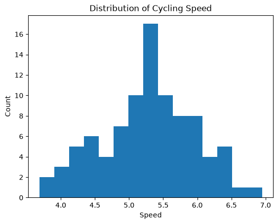
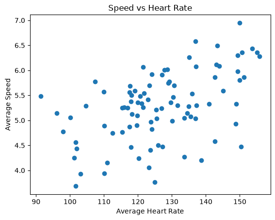
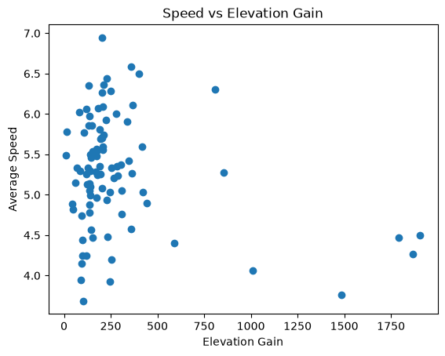

# Cycling Performance Analysis

**Analyzing Strava cycling data to understand how effort and terrain influence cycling speed.**

## Overview
This project analyzes cycling activity data from Strava to understand which factors are most strongly associated with cycling performance, measured using average speed. The project begins with exploratory data analysis and will progress to regression modeling to identify and quantify the variables that best explain performance differences across rides.

## Research Question
Which factors are most strongly associated with cycling speed, and how well can cycling performance be explained using ride characteristics such as heart rate, elevation gain, distance, and duration?

## Project Structure
cycling-performance-analysis/
│
├── data/
│   ├── raw/
│   └── processed/
│
├── notebooks/
│   ├── 01_eda.ipynb
│
├── src/
│   ├── data_cleaning.py
│
├── figures/
│   ├── speed_distribution.png
│   ├── heart_rate_vs_speed.png
│   ├── elevation_vs_speed.png
│
├── README.md
└── requirements.txt

## EDA

The focuses on identifying relationships between cycling performance (average speed) and key explanatory variables, including average heart rate, elevation gain, distance, and moving time.

### Distribution of Cycling Speed
This plot shows the distribution of average cycling speeds across all rides.

### Heart Rate vs Speed
This plot examines the relationship between average heart rate and cycling speed.

### Elevation Gain vs Speed
This plot explores how elevation gain relates to cycling speed.

## What has been seen so far
- Average heart rate shows the strongest positive relationship with cycling speed among the variables analyzed  
- Elevation gain is negatively associated with speed, suggesting terrain has a measurable impact on performance  
- Distance and moving time show weaker relationships with speed compared to physiological and terrain-based features  
- Overall performance appears more influenced by effort and elevation than by ride length alone  

## Next Steps
- Build a regression model to predict cycling speed using the most correlated features  
- Additional variables such as pace and elevation intensity  
- Explore temporal effects such as time of day or seasonal variation  
- Improve interpretability through model coefficient analysis  
